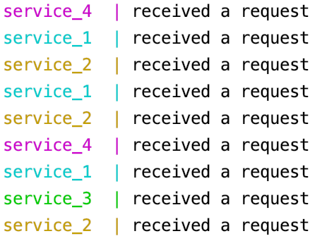

# FancyShortener

- FancyShortener is a url shortener to reduce long links.
- The front-end and business logic is implemented with Express (Node.js).
- For storage a Redis key-value database is used.
- Traefik is used for load balancing between the service instances.
- The Service is protected with basic authentication
    - User: test
    - Password: test

## Getting started

Make sure you are in the repository root.

### Start application

- You can adjust the number services depending of your need.
- Traefik will take care of distributing the load evenly.

```
docker-compose up --build --scale service=2
```
**Once the containers are ready go to**:

- Application: http://localhost
- Traefik Dashboard: http://localhost:8080

**In the console you can see the instance which processed the request**



### Stop application
```
docker-compose down
```

## Limitations

- Only works on localhost
- Port 80 must be free
- Redis does not persist the data
- URLs do never expire
- The main purpose of this project was to develop a distributed application. The project is a demo and does not follow best practises regarding security and software engineering.
    - No testing
    - Hard coded configuration and password
    - etc.
